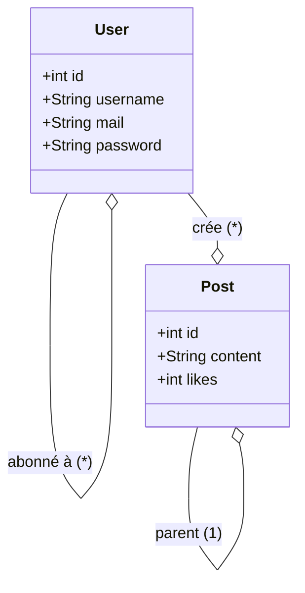

# Documentation

Nous avons pris un peu de temps pour réfléchir à la conception du projet, voici les diagrammes de cas d'utilisation et de classes.

## Diagramme de cas d'utilisation

## Diagramme de classes

